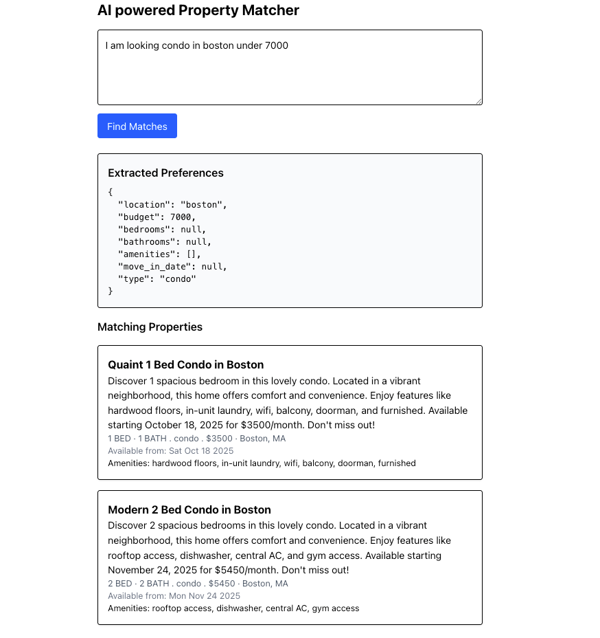

# AI powered Property recommendation

It is an AI powered property recommendation system for tenant

## Description

An AI-powered property recommendation system is an intelligent software solution designed to assist users in finding the most suitable real estate options—such as houses, apartments, or commercial properties—based on their preferences, behavior, and market trends. It leverages advanced artificial intelligence, including Large Language Models (LLMs) and data-driven analytics, to understand user intent, interpret complex queries, and deliver highly personalized and context-aware property search experiences.

## Getting Started

### Dependencies

* You need to have linux (any distro), windows 10/11 or macos to run this app locally

### Installing

* Install node js version 23, docker desktop/docker engine

### Executing program

* Run `npm install --save` for installing all dependencies
* Run `docker compose up -d` for spinning postgresql
* Run `npm run dev` to spin backend app
* Go to `frontend` folder and run `npm run dev` command to spin frontend application

### Tech stack

* Frontend: Next js
* Backend: Express js
* Database: Postgresql
* AI tools: Openrouter.ai
* Models: mistralai/mistral-7b-instruct (for testing purpose)

### Features
* **AI-Powered Preference Extraction** Accepts free-form user messages and uses AI (LLM) to extract structured property preferences such as location, budget, bedrooms, bathrooms, amenities, move-in date, and property type.

* **Flexible Property Matching** Matches properties based on user-specified criteria: location (case-insensitive), budget, minimum bedrooms and bathrooms, move-in date, amenities, and property type.
All filters are optional—users can provide any combination of criteria, and the system will match accordingly.

* **Advanced Amenities Filtering:**
Supports filtering properties by required amenities (e.g., pool, gym, parking, wifi) using PostgreSQL array features.
Returns amenities in the response as an object, showing which requested amenities are present for each property.

* **Sorted Results:** Property matches are sorted by price in ascending order for user convenience.

* **Robust Error Handling:** Handles errors gracefully and returns clear error messages for internal server issues.

* **Extensible API Design:** Modular controller structure allows for easy addition of new features and endpoints.

* **AI-Based Recommendation (Coming Soon):**
Personalized property recommendations powered by advanced AI models, tailored to user preferences and behavior.

### Demo picture

## Authors

Md. Zahid Rahman 

`An enthusiastic Software Developer`
